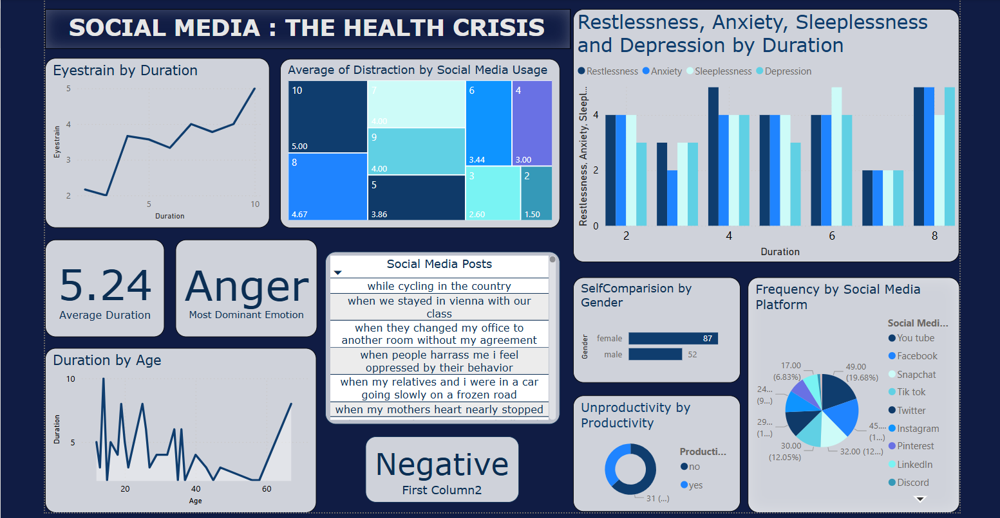

# SOCIAL MEDIA: THE HEALTH CRISIS
This repository contains the final project submitted for the **IBM SkillsBuild Summer Internship Program 2024**, where our team secured **4th place out of 6,123 teams** across India. The project explores the **impact of social media usage on human health**, using real-world data and advanced analytics techniques.

## Problem Statement 
With the rapid rise in social media consumption, especially among youth, there is growing concern over its impact on mental and physical well-being. This project investigates:

- How social media affects sleep, anxiety, and productivity.
- The correlation between screen time and emotional health.
- Public sentiment towards platforms and trends using data.

## Tools & Technologies Used
- **Power BI** – Dashboard and data visualization
- **Python (Pandas, Matplotlib, Seaborn)** – Data preprocessing & analysis
- **NLP** – Sentiment analysis on social media comments
- **Excel & CSV** – Data cleaning and input
- **Kaggle** – Dataset source

## My Role
I served as the **Team Leader** of a 5-member team. My key responsibilities included:

- Guiding the project direction and setting deadlines
- Handling data preprocessing and cleaning in Python
- Designing Power BI dashboards
- Leading the presentation during the IBM SkillsBuild Annual Event 2024 Showcase
 
## Key Insights
- Over 60% of individuals report **increased anxiety** due to excessive social media usage.
- **Night-time screen use** correlates with poor sleep quality and reduced academic focus.
- Sentiment analysis revealed that negative emotions (e.g., sadness, comparison, burnout) were more prevalent in high-usage groups.

## Dashboard Screenshot
Here is a preview of our Power BI dashboard:

## Achievements
- 🥇 **Ranked 4th** nationally among 6,123 teams.
- 🎤 Presented during **IBM SkillsBuild Annual Event 2024**.
- 🛡️ Project praised for real-world relevance and clean visual storytelling.
